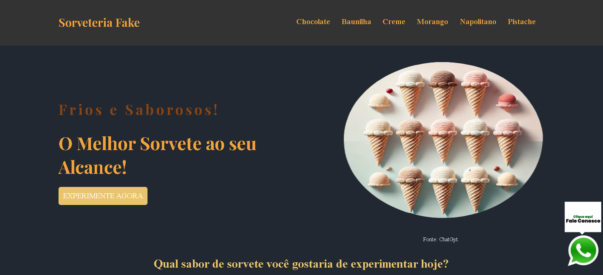

[HTML5]: https://img.shields.io/badge/html5-%23E34F26.svg?style=for-the-badge&logo=html5&logoColor=white
[CSS3]: https://img.shields.io/badge/css3-%231572B6.svg?style=for-the-badge&logo=css3&logoColor=white
<h1 align="center" style="font-weight: bold;">Sorveteria Fake</h1>

![html][HTML5]
![css][CSS3]

 <a href="#about">Sobre</a> • 
 <a href="#technologies">Tecnologias utilizadas</a> •
 <a href="#contribute">Contribuição</a> •
 <a href="#links">Links úteis</a> 

   

<h2 id="about">📌 Sobre</h2>

O site fictício "Sorveteria Fake" apresenta uma interface simples e atraente, destacando sorvetes artesanais em sabores clássicos como chocolate, baunilha e pistache, com preços variando entre R$13 e R$15. Desenvolvido como um projeto demonstrativo em HTML e CSS, o site simula uma loja online de sorvetes. Um diferencial interessante é o efeito 3D aplicado aos seis cards de produtos, implementado com JavaScript interno, proporcionando uma experiência visual envolvente. Para dispositivos móveis, o segredo da responsividade está na interação: o efeito 3D é ativado ao mover o celular de um lado para o outro, criando uma dinâmica única de visualização.

Você pode acessá-lo [aqui](https://sorveteriafake.vercel.app).

<h2 id="technologies">Tecnologias utilizadas</h2>

- **HTML5:** Estrutura da página. 🌐
- **CSS3:** Estilização e animações. 🎨
- **EmojiPedia:** Para os ícones. 👍

<h2 id="contribute">📫 Contribuição</h2>

Agradeço a contribuição para o projeto. Se você está corrigindo um bug, adicionando uma funcionalidade, ou melhorando a documentação, sua contribuição é valiosa. Veja como você pode contribuir:

1. **Criar uma nova funcionalidade**

A adição das respectivas imagens com os cards do site é um boa ideia para tornar o site mais atrativo visualmente.

2. **Siga os padrões de codificação**

Consistência é fundamental! Aderir aos padrões de codificação e padrões estabelecidos no projeto. Isso garante a legibilidade e a manutenção do código.

3. **Espere pela revisão**

Irei rever a sua solicitação de pull. Participe da discussão e faça as alterações solicitadas. Suas contribuições serão mescladas no projeto uma vez aprovada!

<h3 id="links">Links Úteis</h3>

- [Projeto](https://sorveteriafake.vercel.app)
- [Layout](https://www.youtube.com/watch?v=6gRtjwD2w88&list=PL2Fdisxwzt_f5C7Mv0kg1EAHhy2VJLf1c)
- [Layout como referência](https://github.com/EricHidekiMiyahara/facas-doppler)
